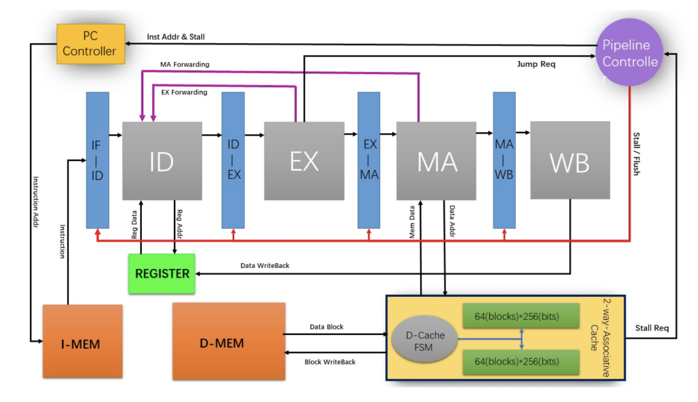
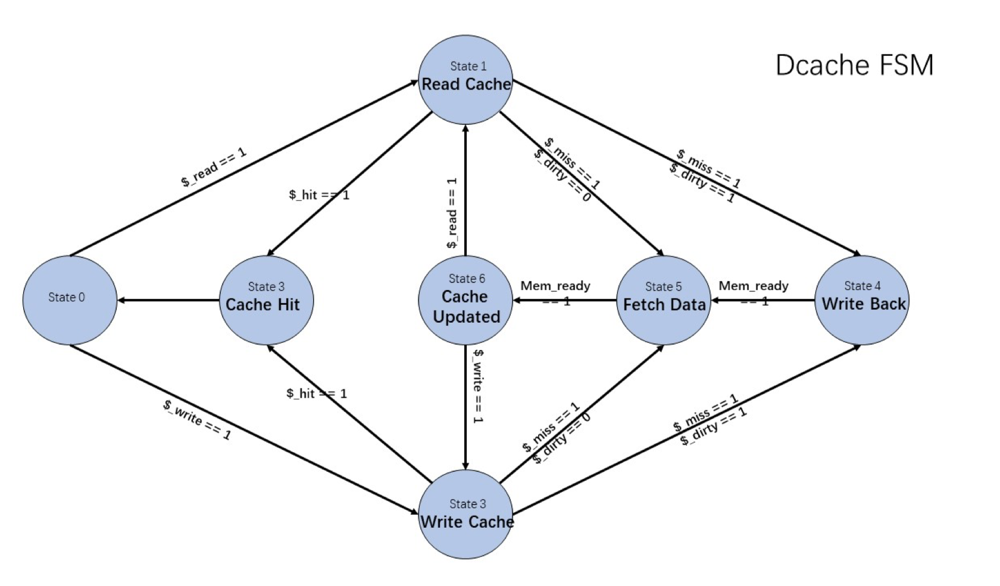

# RISCV-CPU
Write a CPU with 5-stage Pipeline from scratch!
Computer Architecture 2017-2018


### Instruction List
[cheat sheet](Instructions.pdf)
```
LUI AUIPC JAL JALR 
BEQ BNE BLT BGE BLTU BGEU 
LB LH LW LBU LHU 
SB SH SW 
ADDI SLTI SLTIU XORI ORI ANDI SLLI SRLI SRAI 
ADD SUB SLL SLT SLTU 
XOR SRL SRA OR AND 
FENCE FENCE.I
```

### CPU Architecture 
[Design.pdf](RISCV_CPU_Design.pdf)



1. 增加了 EX、MA 两条 Forwarding 线，WB 阶段 Forwarding 由一个 Cycle 内寄存器先写后读实现，解决了除 Load/Store 之外的 RAW Harzard 问题。

2. 内存采用哈佛结构，指令内存与数据内存分开，解决了数据与指令同时 访存的 Structual Hazard

3. 实现了一个 data cache 模块， 内部由状态机控制时序， 采用块大小为 2MB(64*256bit) 的两路组关联 cache，LRU 替换策略

4. 增加了流水线控制单元，监听 cache 模块 stall 信号以及 branch 指令跳 转信号，控制流水线暂停、清空、以及 PC 取指等操作。

### D-Cache


此设计为一级两路组关联 Cache，因此其命中率较高，大概有 80% 左右的 命中率，剩余 20% 情况均摊到 miss 或者 miss 且 dirty 的情况。

我们使用的是 core 等待 cache 响应的机制，因此要提高 cpu 的速率，应考虑尽量缩短 core 对于 cache 进行访问的时间。

为了便于控制 cache 与 core 和 memory 的交互，以及控制时序逻辑的需要, dcache 使用了如图所示的状态机控制内部功能模块。替换方式为 LRU，块大小为 256bits，保证了时间本地性与空间本地性。